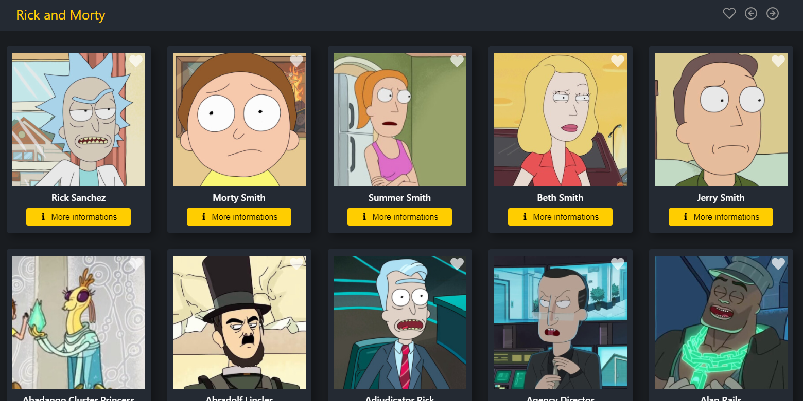

<h1 align="center">Rick and Morty<h1>

 

# Indice
- [About](#-about)
- [Technologies used](#-technologies-used)
- [How to download the project](#-how-to-download-the-project)

---

# About
Project **Rick and Morty** is a card based application with get all Rick and Morty's characters from the [API](https://rickandmortyapi.com/graphql) and shows as cards. This application was developed for fun and for educational purposes to consolidate programming concepts with **React**, **GraphQL**, **ContextAPI**, **Local Storage**, and **Styled Components** 


---

## Technologies used 

The project was developed using the following technologies:

- [Javascript](https://www.w3schools.com/js/default.asp)
- [React](https://pt-br.reactjs.org/)
- [GraphQL](https://graphql.org/learn/)
- [API](https://rickandmortyapi.com/graphql)
- [Styled-Components](https://styled-components.com/)
- [HTML](https://www.w3schools.com/html/)
- [CSS](https://www.w3schools.com/css/default.asp)


---

## 📁 How to download the project
```bash

    #Clone repository
    $ git clone https://github.com/rick-and-morty-app-graphql

    #Enter the project folder
    cd rick-and-morty-app-graphql

    #Install dependencies
    npm install / yarn

    #Execute the application
    npm start / yarn start

```

---
This project is licensed under the MIT | Developed by [Fabio Albiero](http://fabioalbiero.com/)